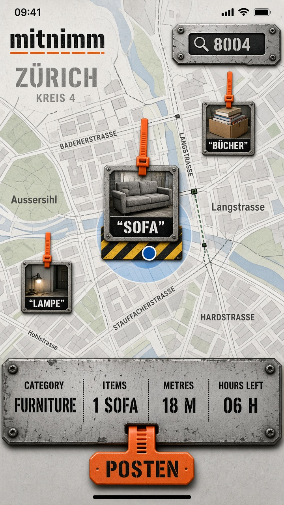

<div align="center">


# mitnimm

**Gratis zum Mitnehmen — mappa svizzera dei mucchi sul marciapiede.**

Fotografi quello che sta in strada. Qualcuno lo prende. Il pin muore in pochi giorni.

[DE](README.md) · [EN](README.en.md) · [FR](README.fr.md) · **IT** · [RM](README.rm.md)

[](https://mitnimm.vercel.app)
[](https://t.me/mitnimmbot)
[](LICENSE)

</div>

<p align="center">
  
</p>

Non Tutti. Non Facebook Marketplace. Non una goccia sulla mappa.

I mucchi sono **foto sulle coordinate**, come etichette da cassa. Fascetta arancione = ancora lì. Striscia hazard = quello che hai scelto.

## Come funziona

1. **Trovare** — mappa, NPA a 4 cifre, o **menu categoria** (TUTTE / Mobili / …). Tocca la foto, vai.
2. **Postare** — al mucchio: GPS + fotocamera live, oppure JPEG dall’album **con GPS nei metadati**. Ritaglia (niente casa). Categoria, nota opzionale.
3. **Via** — marca oggetti o tutto il mucchio. **Ancora lì** azzera il timer di 72h.

Poi la history tiene via + categoria + data. Le foto spariscono.

## API agent

Nessuna auth. Base: https://mitnimm.vercel.app

| | |
|---|---|
| Discovery | [`/api/agent`](https://mitnimm.vercel.app/api/agent) |
| OpenAPI | [`/api/openapi.json`](https://mitnimm.vercel.app/api/openapi.json) |
| Per i modelli | [`/llms.txt`](https://mitnimm.vercel.app/llms.txt) |

```
GET /api/categories
GET /api/spots?category=moebel&q=
GET /api/nearby?plz=8004&km=3&category=velo
GET /api/history?category=
```

`category` è un id (`moebel`) o un’etichetta DE/EN/FR/IT. `q` è testo libero su titolo, oggetti, via.

**POST /api/spots** è per persone sul posto (GPS + foto). Niente post automatici.

Telegram: `/start`, `/lang`, `/km`, oppure un NPA.

## Regole dure

- Solo Svizzera. Niente account.
- Fotocamera live sul posto, o JPEG album con GPS (anti-bot). Album senza GPS rifiutato.
- Solo il mucchio — niente casa, niente facciata, niente numero civico. Ritaglia prima del pin.
- Attribution OpenStreetMap / OpenFreeMap. geo.admin.ch solo per l’NPA.
- Bot Telegram pubblico: `/start`, `/lang`, `/km`, poi NPA.
- Gli agent possono **leggere** l’API JSON. Non devono postare mucchi da soli.

Spec prodotto: [`PRODUCT.md`](PRODUCT.md). Default (tedesco): [`README.md`](README.md).

## Stack

| Strato | Tech |
|---|---|
| Mappa | Vite + TypeScript, MapLibre, OpenFreeMap. Niente React. |
| API | Node (Hono) + SQLite + foto su disco |
| Host | Vercel (mitnimm.vercel.app) |
| Alert | Telegram `@mitnimmbot` |

## In locale

```bash
npm install
npm run dev
```

http://localhost:5173 fa da proxy di `/api` verso http://127.0.0.1:8787

Copia `.env.example`. Il token del bot sta in `.dev.vars` (gitignored). Non committarlo mai.

```
TELEGRAM_BOT_TOKEN=
APP_URL=http://localhost:5173
```

## Deploy

`render.yaml` è il Blueprint. Istanza free. Build `npm ci && npm run build`, start `npx tsx worker/src/node.ts`.

Il free Render dorme dopo 15 minuti di idle — il primo hit può richiedere un minuto. Il disco è effimero; i mucchi spariscono se l’istanza viene ricreata.

Webhook:

```
https://api.telegram.org/bot<token>/setWebhook?url=https://mitnimm.vercel.app/api/telegram
```

## Licenza

[MIT](LICENSE)
